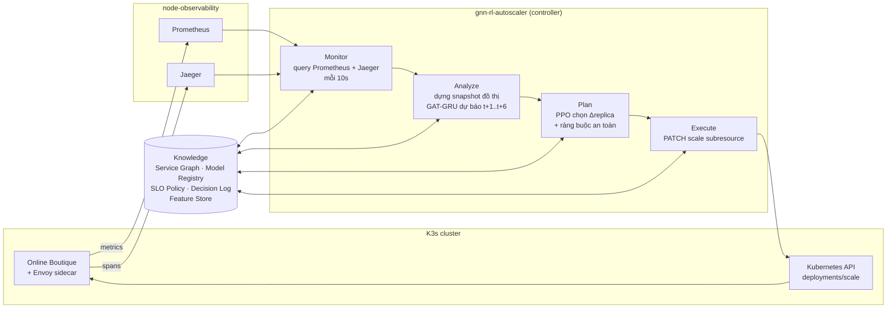

# thesis-gnn-rl-autoscaling

**Tối ưu hóa autoscaling chủ động cho ứng dụng microservices sử dụng mạng nơ-ron đồ thị và học tăng cường**
*(Proactive autoscaling optimization for microservices applications using graph neural networks and reinforcement learning)*

Khóa luận tốt nghiệp, Khoa Mạng máy tính và Truyền thông, Trường ĐH Công nghệ Thông tin, ĐHQG TP.HCM.
GVHD: TS. Huỳnh Văn Đặng. Sinh viên: Lê Trung Kiên (23520797), Trần Thị Thùy Tiên (23521588).

Repo chứa toàn bộ hạ tầng dưới dạng code: tạo máy ảo, dựng cụm Kubernetes, triển khai ứng dụng benchmark, giám sát/truy vết, sinh tải và thu thập dữ liệu. Đây là nền tảng để huấn luyện và đánh giá cơ chế autoscaling **GAT-GRU + PPO** so với **Kubernetes HPA**.

---

## Mục lục

1. [Tổng quan đề tài](#1-tổng-quan-đề-tài)
2. [Hạ tầng](#2-hạ-tầng)
3. [Công cụ, công nghệ và mục tiêu sử dụng](#3-công-cụ-công-nghệ-và-mục-tiêu-sử-dụng)
4. [Cấu trúc repo và thứ tự triển khai](#4-cấu-trúc-repo-và-thứ-tự-triển-khai)
5. [Bài toán: GAT-GRU và PPO](#5-bài-toán-gat-gru-và-ppo)
6. [Bộ dataset](#6-bộ-dataset)
7. [Vòng lặp MAPE-K và đề xuất tích hợp pha Knowledge](#7-vòng-lặp-mape-k-và-đề-xuất-tích-hợp-pha-knowledge)
8. [Đề xuất đưa mô hình vào cụm](#8-đề-xuất-đưa-mô-hình-vào-cụm)
9. [Kịch bản thực nghiệm cuối: so sánh với HPA](#9-kịch-bản-thực-nghiệm-cuối-so-sánh-với-hpa)
10. [Bảo mật và lưu ý vận hành](#10-bảo-mật-và-lưu-ý-vận-hành)

---

## 1. Tổng quan đề tài

Các microservice gọi lẫn nhau tạo thành một **đồ thị phụ thuộc**. Khi tải tăng đột biến, độ trễ tại một service có thể lan dọc chuỗi gọi và gây hiệu ứng dây chuyền (cascading failure). Kubernetes HPA mặc định có hai hạn chế:
- **Phản ứng thụ động (reactive):** chỉ scale *sau khi* CPU đã vượt ngưỡng, cộng thêm 30–60s để pod mới sẵn sàng.
- **Xét từng service riêng lẻ:** bỏ qua quan hệ phụ thuộc, nên service downstream chỉ được scale khi tải đã dồn tới nó.

Đề tài đề xuất cơ chế **proactive horizontal autoscaling** tổ chức theo vòng lặp **MAPE-K**:
- **GAT-GRU** dự báo nhu cầu tải/tài nguyên của từng service trong tương lai gần. GAT khai thác quan hệ không gian trên đồ thị dịch vụ, GRU khai thác quan hệ theo thời gian.
- **PPO** dùng kết quả dự báo để chọn số replica, cân bằng giữa **duy trì SLO**, **hiệu quả tài nguyên** và **độ ổn định** (tránh scale dao động).
- **Controller** thực thi quyết định qua Kubernetes API, và được so sánh với **HPA** và một **proactive baseline**.

Giới hạn (theo đề cương):
- Chỉ scale ngang.
- Chỉ dùng một ứng dụng benchmark (Online Boutique).
- PPO huấn luyện offline, sau đó triển khai online.
- Tải sinh từ kịch bản có kiểm soát.

---

## 2. Hạ tầng

Môi trường chạy trên **OpenStack (UIT NetChallenge)**, gồm 5 máy ảo trong một private network `10.42.0.0/24`.

```text
                         OpenStack project (quota 16 vCPU / 24 GB RAM / 200 GB)
 ┌────────────────────────────────────────────────────────────────────────────────────────┐
 │  K3s cluster (pod CIDR 10.244.0.0/16, service CIDR 10.96.0.0/16, Flannel VXLAN)        │
 │  ┌──────────────────────┐   ┌───────────────────────┐   ┌───────────────────────┐      │
 │  │ node-app  (2 vCPU)   │   │ node-app-worker-1     │   │ node-app-worker-2     │      │
 │  │ control-plane        │   │ (4 vCPU / 8 GB)       │   │ (4 vCPU / 8 GB)       │      │
 │  │ taint NoSchedule     │   │ Online Boutique pods  │   │ Online Boutique pods  │      │
 │  │ istiod, ServiceLB    │   │ + istio-proxy sidecar │   │ + istio-proxy sidecar │      │
 │  │ Floating IP          │   │ (chỉ fixed IP)        │   │ (chỉ fixed IP)        │      │
 │  └──────────┬───────────┘   └───────────┬───────────┘   └───────────┬───────────┘      │
 │             │ kubelet :10250 (cAdvisor) ◀──────── scrape ─────────────┐                  │
 │             │ Envoy spans (Zipkin) ──────────────────────────────┐  │                  │
 │  ┌──────────┴───────────┐                              ┌──────────▼──┴──────────┐      │
 │  │ node-loadgen (1 vCPU)│ ── HTTP ─▶ frontend-external │ node-observability     │      │
 │  │ Locust + collector   │   (NodePort)                 │ (1 vCPU, Docker)       │      │
 │  │ Floating IP          │ ── query_range / api/traces ▶│ Prometheus :9090       │      │
 │  └──────────────────────┘                              │ Grafana :3000          │      │
 │                                                        │ kube-state-metrics     │      │
 │                                                        │ Jaeger :16686 / :9411  │      │
 │                                                        │ Floating IP            │      │
 │                                                        └────────────────────────┘      │
 └────────────────────────────────────────────────────────────────────────────────────────┘
```

| Node | Vai trò | Flavor | Ghi chú |
|---|---|---|---|
| `node-app` | K3s control-plane | 2 vCPU, 20 GB | Label `node-role=control-plane`, taint `dedicated=control-plane:NoSchedule`; chạy istiod, các system pod và (đề xuất) controller autoscaling |
| `node-app-worker-1`, `node-app-worker-2` | Application worker | 4 vCPU / 8 GB, 40 GB | Label `node-role=app-worker`; nhận toàn bộ pod Online Boutique (preferred anti-affinity giữa hai worker) |
| `node-observability` | Giám sát, truy vết | 1 vCPU, 50 GB | **Ngoài cụm**, Docker Compose: Prometheus, Grafana, kube-state-metrics, Jaeger |
| `node-loadgen` | Sinh tải | 1 vCPU, 30 GB | **Ngoài cụm**: Locust và script xuất telemetry |

**Nguyên tắc thiết kế:** giám sát và sinh tải đặt **ngoài cụm**, để chúng không tranh tài nguyên với ứng dụng đang được đo. Như vậy dữ liệu CPU/latency phản ánh đúng ứng dụng, và quyết định scale không bị nhiễu bởi chính công cụ đo.

Chi tiết: [`terraform-openstack/README.md`](terraform-openstack/README.md), [`cluster-setup/README.md`](cluster-setup/README.md).

---

## 3. Công cụ, công nghệ và mục tiêu sử dụng

| Lớp | Công nghệ (phiên bản) | Mục tiêu trong đề tài |
|---|---|---|
| Hạ tầng đám mây | **OpenStack** (Nova, Neutron, Cinder) | Cung cấp máy ảo, mạng riêng, Floating IP, security group cho môi trường thực nghiệm thật |
| Infrastructure as Code | **Terraform** ≥ 1.6, provider `openstack` v3.x | Mô tả 5 VM, mạng, security group dưới dạng code: dựng lại và hủy được, tái lập được khi hạ tầng hỏng hoặc đổi IP |
| Điều phối container | **K3s** `v1.34.9+k3s1` | Kubernetes nhẹ, phù hợp VM nhỏ. Có sẵn **metrics-server** (cho HPA baseline) và **ServiceLB** (expose frontend). Traefik bị tắt |
| Mạng cụm | **Flannel** (VXLAN, mặc định của K3s) | Mạng pod giữa 3 node |
| Đóng gói ứng dụng | **Helm** | Triển khai Online Boutique từ chart upstream (vendor theo commit), kèm patch resource, probe, anti-affinity tái lập được |
| Ứng dụng benchmark | **Online Boutique** (Google `microservices-demo`) | 11 microservice (Go, C#, Node.js, Python, Java) gọi nhau qua gRPC: đồ thị phụ thuộc thực tế, nhiều ngôn ngữ, có chuỗi checkout sâu |
| Service mesh | **Istio** `1.31.0` (profile minimal, Envoy sidecar) | Sidecar Envoy ghi **span cho mọi lời gọi** giữa service mà không phải sửa code ứng dụng. Đây là nguồn dữ liệu cạnh của đồ thị (ai gọi ai, bao nhiêu, mất bao lâu) |
| Thu metric | **Prometheus** `v2.54.1` | Scrape cAdvisor trên 3 kubelet và kube-state-metrics mỗi 10s; cung cấp `query_range` để xuất dữ liệu và (đề xuất) phục vụ pha Monitor của controller |
| Metric container | **cAdvisor** (tích hợp kubelet) | CPU, memory, network, CPU throttling theo container/pod |
| Metric trạng thái K8s | **kube-state-metrics** `v2.13.0` | Số replica, request/limit, restart: năng lực hiện tại và biến PPO điều khiển |
| Truy vết phân tán | **Jaeger** `1.60.0` all-in-one, lưu trữ Badger | Nhận span Zipkin từ Envoy (sampling 100%); cung cấp RPS, latency, lỗi theo service và theo cạnh để xây Service Graph |
| Trực quan hóa | **Grafana** `11.2.0` | Dashboard theo dõi trong lúc thu dữ liệu và thực nghiệm |
| Sinh tải | **Locust** `2.31.8` | Mô phỏng người mua hàng; `LoadTestShape` tạo các kịch bản Normal, Spike, Bursty (Ramp đề xuất bổ sung) |
| Xử lý dữ liệu | **Python**, NumPy, pandas, Matplotlib, Jupyter | Xuất telemetry, tiền xử lý, tạo tensor đồ thị cho GAT-GRU |
| Học máy *(đề xuất)* | **PyTorch**, **PyTorch Geometric** (`GATConv`/`GATv2Conv`) | Cài đặt và huấn luyện GAT-GRU |
| Học tăng cường *(đề xuất)* | **Gymnasium**, **Stable-Baselines3** (PPO) | Môi trường RL offline và huấn luyện tác tử PPO |
| Controller *(đề xuất)* | Python `kubernetes` client, ONNX Runtime / TorchScript | Chạy vòng lặp MAPE-K trong cụm, gọi `scale` subresource của Deployment |
| Tự động hóa | Bash, SSH (ProxyJump), rsync, jq | Các script cài đặt 00–06, chạy kịch bản và kéo kết quả |

---

## 4. Cấu trúc repo và thứ tự triển khai

```text
thesis-gnn-rl-autoscaling/
├── terraform-openstack/         # IaC: 5 VM, mạng, security group, Floating IP
│   ├── environments/dev/        #   root module + terraform.tfvars (không commit)
│   ├── modules/                 #   networking, security-group, keypair, compute, floating-ip
│   └── scripts/replace-floating-ips.sh
├── cluster-setup/               # Script dựng cụm và các dịch vụ, chạy tuần tự 00 → 06
│   ├── 00-generate-node-ips.sh  #   sinh node-ips.env từ terraform output
│   ├── 01-install-server.sh     #   K3s control-plane + token Prometheus
│   ├── 01b-install-worker.sh    #   join worker qua ProxyJump
│   ├── 02-install-istio.sh      #   Istio + ServiceEntry Jaeger + injection
│   ├── 03-deploy-online-boutique.sh
│   ├── 04-setup-monitoring.sh   #   Prometheus, Grafana, KSM, Jaeger trên node-observability
│   ├── 05-setup-tracing.sh      #   Telemetry sampling 100% + rollout
│   ├── 06-setup-loadgen.sh      #   Locust venv trên node-loadgen
│   └── verify-istio-injection.sh
├── k8s-manifests/online-boutique/  # Helm chart (vendor) + values-override.yaml
├── monitoring-stack/            # docker-compose, prometheus.yml, Grafana provisioning
└── load-testing/                # Kịch bản tải, thu thập và tiền xử lý dataset
    ├── locustfile.py, scenarios/{normal,spike,bursty}.py
    ├── run-scenario.sh, collect_metrics.py
    ├── preprocess_gatgru.ipynb
    ├── README.md                #   các bước chạy load test
    └── DATASET_GUIDE.md         #   kiến thức về thu thập dataset
```

Thứ tự triển khai (chi tiết trong từng README):

```bash
# 1. Hạ tầng
cd terraform-openstack && source openstack-openrc.sh
terraform -chdir=environments/dev init && terraform -chdir=environments/dev apply
cd ..
# 2. Cụm và dịch vụ
bash cluster-setup/00-generate-node-ips.sh
bash cluster-setup/01-install-server.sh
source cluster-setup/node-ips.env
bash cluster-setup/01b-install-worker.sh "$NODE_WORKER1_FIXED_IP"
bash cluster-setup/01b-install-worker.sh "$NODE_WORKER2_FIXED_IP"
bash cluster-setup/02-install-istio.sh
bash cluster-setup/03-deploy-online-boutique.sh
bash cluster-setup/00-generate-node-ips.sh      # cập nhật FRONTEND_URL sau khi có frontend-external
bash cluster-setup/04-setup-monitoring.sh
bash cluster-setup/05-setup-tracing.sh
bash cluster-setup/06-setup-loadgen.sh
# 3. Thu dữ liệu (xem load-testing/README.md)
bash load-testing/run-scenario.sh normal 8
```

---

## 5. Bài toán: GAT-GRU và PPO

### 5.1 Mô hình hóa hệ thống thành đồ thị theo thời gian

Tại mỗi bước thời gian $t$ (10 giây), hệ thống được biểu diễn bằng đồ thị $\mathcal{G}_t = (V, E, X_t, A_t)$:
- $V$: 11 service của Online Boutique (nút).
- $E$: quan hệ gọi dịch vụ, gồm topology tĩnh và các cạnh quan sát được từ trace (cạnh có hướng `caller → callee`).
- $X_t \in \mathbb{R}^{N \times F}$: đặc trưng nút (tải, latency, lỗi, CPU, memory, network, replica, ...).
- $A_t \in \mathbb{R}^{M \times F_e}$: đặc trưng cạnh (tần suất gọi, tỉ lệ fan-out, latency, lỗi).

### 5.2 GAT-GRU: dự báo nhu cầu

$$\hat{Y}_{t+1:t+h} = f_\theta\left(\mathcal{G}_{t-w+1}, \dots, \mathcal{G}_t\right), \qquad \hat{Y} \in \mathbb{R}^{h \times N \times K}$$

- **Đầu vào:** chuỗi $w = 12$ snapshot (2 phút).
- **Đầu ra:** dự báo $h = 6$ bước (60s) cho $K = 2$ target của mỗi service: `rps_in` (nhu cầu tải) và `cpu_cores` (nhu cầu tài nguyên). Horizon 60s bao được thời gian một pod mới sẵn sàng, nên quyết định scale có thể đi *trước* tải.
- **Kiến trúc đề xuất:**
  1. **GAT** tại từng bước $\tau$: mỗi service tổng hợp thông tin từ các service láng giềng với trọng số attention $\alpha_{ij}$ học từ dữ liệu, có dùng đặc trưng cạnh $A_\tau$. Attention cho phép mô hình học *mức độ phụ thuộc động*: cạnh gọi nhiều hoặc chậm thì ảnh hưởng nhiều hơn.
  2. **GRU** chạy trên chuỗi embedding của từng nút (trọng số chia sẻ giữa các nút) để nắm xu hướng theo thời gian.
  3. **Đầu ra tuyến tính** cho $h \times K$ giá trị mỗi nút.
- **Huấn luyện:** loss MSE/Huber trên target đã chuẩn hóa. **Đánh giá:** MAE, RMSE trên đơn vị gốc, so với baseline persistence ($\hat y_{t+k} = y_t$), GRU không có đồ thị và các biến thể ablation.

### 5.3 PPO: quyết định số replica

| Thành phần | Định nghĩa đề xuất |
|---|---|
| **State** $s_t$ | Với mỗi service: metric hiện tại (CPU util, p95 latency, error rate, RPS), **nhu cầu dự báo** $\hat{y}_{t+1:t+h}$ từ GAT-GRU, số replica hiện tại, cờ vi phạm SLO, thời gian từ lần scale gần nhất. Toàn cục: p95 và lỗi end-to-end tại frontend |
| **Action** $a_t$ | $\Delta\text{replica} \in \{-1, 0, +1\}$ cho mỗi service được scale (MultiDiscrete), bị chặn trong $[r_{\min}, r_{\max}] = [1, 4]$ |
| **Reward** $r_t$ | $r_t = -\lambda_{\text{SLO}} \cdot \text{SLOviol}_t \;-\; \lambda_{\text{res}} \cdot \frac{\sum_i \text{replica}_i \cdot \text{req}_i}{\text{capacity}} \;-\; \lambda_{\text{stab}} \cdot \sum_i \lvert a_{t,i} \rvert$. Ba thành phần ứng với tuân thủ SLO, hiệu quả tài nguyên và độ ổn định |
| **Transition** | Môi trường **offline** xây từ dataset: với tải dự báo và số replica mới, mô hình chuyển trạng thái (học từ dữ liệu thu được, gồm cả dữ liệu có HPA) ước lượng CPU mỗi pod và latency ở bước tiếp theo |
| **Huấn luyện** | Curriculum learning: **Normal** (học giữ ổn định) → **Bursty** (học phân biệt nhiễu, tránh thrashing) → **Spike** (học ưu tiên SLO khi tải đột biến) |
| **Đầu ra** | Chính sách $\pi_\phi(a \mid s)$, xuất sang TorchScript/ONNX để chạy trong controller |

---

## 6. Bộ dataset

Thu bằng `load-testing/` (xem [`load-testing/README.md`](load-testing/README.md) và [`load-testing/DATASET_GUIDE.md`](load-testing/DATASET_GUIDE.md)).

| Khía cạnh | Mô tả |
|---|---|
| Kịch bản | **Normal** (40 user ±10%), **Spike** (25 → 220 user, 90s, mỗi 6 phút), **Bursty** (nền 20 user, burst ngẫu nhiên 80–180 user). **Ramp** có trong đề cương, đề xuất bổ sung theo cùng mẫu |
| Quy mô | 8 run × 30 phút cho mỗi kịch bản; 180 bước × 11 service mỗi run; khoảng 3.768 cửa sổ huấn luyện cho 3 kịch bản. Đề xuất thêm 4 run/kịch bản khi có HPA bật để PPO thấy được tác động của scaling |
| Nguồn | Prometheus (cAdvisor + kube-state-metrics), Jaeger (span Envoy), Locust (chỉ dùng để kiểm tra độ phủ) |
| Đặc trưng nút (15) | Tải: `rps_in`, `rps_in_delta`, `rps_per_replica`. Hiệu năng: `latency_p50/p95_ms`, `error_rate`. Tài nguyên: `cpu_cores`, `cpu_util_request`, `cpu_throttle_ratio`, `cpu_sidecar_cores`, `mem_mib`, `net_rx/tx_kBps`. Năng lực: `replicas`, `restarts_delta` |
| Đặc trưng cạnh (4) | `call_rate`, `call_ratio` (fan-out), `edge_error_rate`, `edge_latency_p95_ms` |
| Đặc trưng toàn đồ thị (5) | `e2e_rps`, `e2e_latency_p95_ms`, `e2e_error_rate`, `slo_violation`, `total_replicas` |
| Target | `rps_in`, `cpu_cores` của từng service tại $t+1 \dots t+6$ |
| Tiền xử lý | Căn lưới 10s, bỏ warm-up 60s, clip p99,9, `log1p`, z-score (fit trên train), cửa sổ trượt trong từng run, **chia train/val/test theo run** để tránh rò rỉ |
| Đầu ra | `processed/gatgru_dataset.npz` (`X` [S, 12, 11, 15], `E` [S, 12, M, 4], `G` [S, 12, 5], `Y` [S, 6, 11, 2], `edge_index`), `metadata.json` (scaler, tên feature), `timeseries_raw.csv` (cho môi trường PPO) |

Nguyên tắc quan trọng: **chỉ dùng đặc trưng quan sát được khi triển khai thật**. Số user của Locust không được đưa vào mô hình.

---

## 7. Vòng lặp MAPE-K và đề xuất tích hợp pha Knowledge

### 7.1 Ánh xạ các pha vào kiến trúc



| Pha | Thành phần trong repo | Đã có / đề xuất |
|---|---|---|
| **Monitor** | Prometheus (cAdvisor, KSM), Jaeger (span Envoy), logic truy vấn của `collect_metrics.py` | Đã có. Controller tái sử dụng logic truy vấn này cho cửa sổ 10s gần nhất |
| **Analyze** | Dựng snapshot đồ thị bằng **đúng** phép biến đổi trong `preprocess_gatgru.ipynb`, rồi suy luận GAT-GRU | Đề xuất |
| **Plan** | PPO policy và lớp an toàn | Đề xuất |
| **Execute** | Gọi `PATCH /apis/apps/v1/namespaces/online-boutique/deployments/<svc>/scale` | Đề xuất |
| **Knowledge** | Xem 7.2 | Đề xuất |

### 7.2 Đề xuất thiết kế pha Knowledge

Pha K là **bộ nhớ dùng chung** của vòng lặp: các pha khác đọc ngữ cảnh từ đây và ghi kết quả vào đây. Đề xuất gồm 5 thành phần, dùng tối đa hạ tầng đã có:

| Thành phần | Nội dung | Hiện thực đề xuất | Ai đọc / ghi |
|---|---|---|---|
| **Service Graph** | Topology tĩnh, cạnh phát hiện từ trace, trọng số `call_ratio` trung bình, attention gần nhất của GAT | File `knowledge/service_graph.json` (từ `metadata.json` của dataset), cập nhật định kỳ từ Jaeger | A đọc (edge_index); A ghi attention để giải thích quyết định |
| **Model Registry** | Trọng số GAT-GRU và PPO theo phiên bản, kèm `metadata.json` (scaler, tên feature, w, h) và chỉ số MAE/RMSE lúc huấn luyện | Thư mục versioned trên PVC (hoặc MinIO trên node-observability): `models/v{n}/{gatgru.onnx, ppo.onnx, metadata.json}` | A, P đọc phiên bản đang `active` |
| **SLO & Policy** | Ngưỡng SLO (p95 300ms, lỗi 1%), giới hạn replica, danh sách service được scale, cooldown, hệ số reward, chế độ (`gatgru-ppo`, `predictive`, `shadow`) | ConfigMap `autoscaler-policy` (giai đoạn sau có thể nâng lên CRD `AutoscalingPolicy`) | P, E đọc; người vận hành sửa |
| **Decision Log** | Mỗi chu kỳ: state, dự báo, action, action sau lớp an toàn, kết quả thực tế ở các bước sau | Controller expose `/metrics` cho Prometheus (`autoscaler_forecast`, `autoscaler_action`, `autoscaler_reward`, `autoscaler_forecast_error`), cộng file JSONL trên PVC | E ghi; dùng để đánh giá và huấn luyện lại |
| **Feature Store** | Bộ đệm trượt `w` snapshot gần nhất, đã chuẩn hóa | Bộ nhớ trong controller, khôi phục từ Prometheus `query_range` khi restart | M ghi, A đọc |

**Vòng phản hồi của Knowledge.** Phần này giúp K không chỉ là nơi lưu trữ:
1. **Giám sát độ chính xác online:** controller so sánh dự báo $\hat y_{t+k}$ với giá trị thực khi thời điểm $t+k$ đến, rồi xuất `autoscaler_forecast_error` (MAE trượt 10 phút).
2. **Phát hiện drift và fallback:** nếu MAE online vượt $2\times$ MAE lúc kiểm thử offline trong một khoảng thời gian định trước, hoặc mất dữ liệu Monitor, controller chuyển sang **chế độ an toàn** (rule giống HPA: CPU 70%) và gắn cờ cần huấn luyện lại.
3. **Huấn luyện lại offline** (phù hợp giới hạn "PPO huấn luyện offline" của đề cương): Decision Log và telemetry được xuất thành run mới theo đúng định dạng `load-testing/results/`, chạy lại notebook, huấn luyện, kiểm thử, rồi đăng ký phiên bản mới vào Model Registry.
4. **Triển khai có kiểm soát:** phiên bản mới chạy ở chế độ **shadow** (dự báo và quyết định nhưng không thực thi, chỉ ghi log) cho đến khi chỉ số trong Decision Log đạt yêu cầu, sau đó mới chuyển sang `active`.

---

## 8. Đề xuất đưa mô hình vào cụm

### 8.1 Đóng gói

```text
autoscaler/                         (đề xuất thư mục mới)
├── Dockerfile                      # python:3.11-slim + onnxruntime + kubernetes + requests
├── controller/
│   ├── monitor.py                  # tái sử dụng truy vấn của load-testing/collect_metrics.py (cửa sổ 10s cuối)
│   ├── features.py                 # cùng phép biến đổi với preprocess_gatgru.ipynb, đọc scaler từ metadata.json
│   ├── analyze.py                  # GAT-GRU (ONNX) -> dự báo t+1..t+6
│   ├── plan.py                     # PPO (ONNX) + lớp an toàn
│   ├── execute.py                  # PATCH deployments/scale
│   └── main.py                     # vòng lặp MAPE-K, /metrics, /healthz
└── deploy/
    ├── namespace.yaml              # namespace autoscaler (KHÔNG inject Istio)
    ├── rbac.yaml                   # ServiceAccount + Role: get/list deployments, get/patch deployments/scale
    ├── configmap-policy.yaml       # SLO, bounds, mode, danh sách service
    ├── pvc-models.yaml             # Model Registry + Decision Log
    └── deployment.yaml             # 1 replica, nodeSelector control-plane + toleration
```

Lý do của các lựa chọn:
- **Xuất mô hình sang ONNX/TorchScript:** image controller không cần PyTorch hay PyG (nhẹ hơn vài GB). Suy luận GAT-GRU cỡ nhỏ cho 11 nút chỉ mất vài ms trên CPU.
- **Đặt controller trên `node-app` (control-plane)**, có toleration cho taint `dedicated=control-plane:NoSchedule`, giống cách istiod đang được pin. Controller không chiếm CPU của worker đang chạy ứng dụng, nên số liệu thực nghiệm không bị nhiễu.
- **Namespace riêng, không inject sidecar:** controller không phải là một phần của đồ thị dịch vụ đang được đo.
- **RBAC tối thiểu:** chỉ được scale Deployment trong `online-boutique`.
- **Kết nối Monitor:** controller truy vấn Prometheus/Jaeger trên `node-observability` qua fixed IP. Security group hiện đã mở 9090 và 16686.

### 8.2 Chu kỳ điều khiển và lớp an toàn

| Tham số | Giá trị đề xuất | Lý do |
|---|---|---|
| Chu kỳ Monitor/Analyze | 10s | Khớp `scrape_interval` và bước của dataset |
| Chu kỳ quyết định (Plan/Execute) | 30s | Giảm dao động; tương đương nhịp xử lý của HPA |
| Biên độ | $\lvert\Delta\rvert \le 1$ replica mỗi service mỗi quyết định | Tránh nhảy bậc lớn do dự báo sai |
| Giới hạn | `minReplicas=1`, `maxReplicas=4` | Giống cấu hình HPA baseline để so sánh công bằng; vừa với 2 worker × 4 vCPU |
| Cooldown scale-down | 120s sau lần scale gần nhất | Tránh thrashing khi tải bursty |
| Fallback | Rule CPU 70% khi mất dữ liệu Monitor hoặc drift | Đảm bảo hệ thống không mất khả năng scale |
| Xung đột với HPA | **Xóa HPA** của các Deployment do controller quản lý | Hai bộ điều khiển cùng scale một Deployment sẽ tranh chấp nhau |

### 8.3 Lộ trình triển khai

1. **Shadow mode:** controller chạy song song với HPA, chỉ ghi quyết định. So sánh quyết định của PPO với HPA trên cùng tải, đồng thời xác nhận pipeline feature online cho kết quả khớp với notebook.
2. **Active trên một service** (ví dụ `frontend` hoặc `currencyservice`), các service khác vẫn dùng HPA.
3. **Active toàn bộ** các service được scale. Khi đó chạy thực nghiệm cuối (mục 9).

---

## 9. Kịch bản thực nghiệm cuối: so sánh với HPA

### 9.1 Thiết kế

| Yếu tố | Thiết lập |
|---|---|
| **Phương pháp so sánh** | (1) **HPA**: `--cpu-percent=70`, min 1, max 4, `behavior` mặc định. (2) **Proactive baseline**: GRU không có đồ thị dự báo CPU, rồi áp quy tắc $\text{replica} = \lceil \hat{\text{cpu}}_{t+h} / (0{,}7 \cdot \text{request}) \rceil$. (3) **GAT-GRU + PPO** |
| **Service được scale** | Giống nhau cho cả 3 phương pháp: `frontend`, `cartservice`, `checkoutservice`, `currencyservice`, `productcatalogservice`, `recommendationservice` (các service còn lại cố định 1 replica) |
| **Kịch bản tải** | Normal, Ramp (bổ sung), Spike, Bursty, mỗi run 30 phút |
| **Lặp lại** | 3 run cho mỗi (phương pháp × kịch bản), tổng $3 \times 4 \times 3 = 36$ run, khoảng 22 giờ |
| **So sánh cặp** | Cùng chuỗi tải cho cả 3 phương pháp: dùng cùng `BURSTY_SEED` (ví dụ 101, 102, 103) cho run thứ *k* của mỗi phương pháp. Mọi khác biệt khi đó đến từ autoscaler, không đến từ tải |
| **Thứ tự** | Xen kẽ phương pháp (HPA → baseline → GAT-GRU+PPO → HPA → …) để tránh thiên lệch do trạng thái hạ tầng thay đổi theo thời gian |
| **Dữ liệu mô hình** | Run thực nghiệm **không** trùng với run dùng để huấn luyện (seed và thời điểm khác) |

### 9.2 Quy trình mỗi run

```bash
# 0. Reset về trạng thái chuẩn
kubectl -n online-boutique delete hpa --all
kubectl -n online-boutique scale deployment --all --replicas=1
kubectl -n autoscaler scale deployment gnn-rl-autoscaler --replicas=0
sleep 120

# 1. Bật đúng một phương pháp
#   HPA:
for d in frontend cartservice checkoutservice currencyservice productcatalogservice recommendationservice; do
  kubectl -n online-boutique autoscale deployment "$d" --cpu-percent=70 --min=1 --max=4
done
#   hoặc controller:
#   kubectl -n autoscaler patch configmap autoscaler-policy --type merge -p '{"data":{"mode":"gatgru-ppo"}}'   # hoặc "predictive"
#   kubectl -n autoscaler scale deployment gnn-rl-autoscaler --replicas=1

# 2. Chạy tải và thu telemetry. AUTOSCALER được ghi vào meta.json để phân biệt phương pháp.
AUTOSCALER=hpa BURSTY_SEED=101 COOLDOWN_SEC=0 bash load-testing/run-scenario.sh bursty 1
```

`run-scenario.sh` và `collect_metrics.py` đã xuất đủ dữ liệu để tính các chỉ số bên dưới: replica theo thời gian (KSM), CPU (cAdvisor), latency và lỗi (Jaeger), p95/p99 phía client (Locust). Đề xuất thêm script `experiments/run-comparison.sh` để lặp qua (phương pháp × kịch bản × seed), và notebook `experiments/evaluate.ipynb` để tính chỉ số.

### 9.3 Chỉ số đánh giá (theo đề cương)

Ký hiệu: $\Delta t = 10s$ là một bước; $r_{i,t}$ là replica của service $i$; $u_{i,t}$ là CPU dùng; $q_i$ là CPU request mỗi pod.

| Chỉ số | Công thức / cách đo | Tốt khi |
|---|---|---|
| **P95 / P99 latency** | Phân vị thời gian phản hồi phía client (Locust `locust_stats.csv`, dòng Aggregated) và tại frontend (Jaeger) | Thấp |
| **SLO violation (%)** | $\frac{1}{T}\sum_t \mathbb{1}[\text{p95}_t > 300\text{ms} \lor \text{err}_t > 1\%]$ trên frontend | Thấp |
| **Error rate** | Tổng request lỗi / tổng request (Locust) | Thấp |
| **Resource utilization** | $\frac{\sum_{i,t} u_{i,t}}{\sum_{i,t} r_{i,t}\, q_i}$ | Cao (gần mục tiêu ~70%) |
| **Overprovisioning** | $\frac{1}{T}\sum_t \sum_i \max(0,\; r_{i,t} q_i - u_{i,t}/0{,}7)$ (core thừa so với mức cần ở 70%) | Thấp |
| **Chi phí tài nguyên** | Tổng replica-giờ $\sum_{i,t} r_{i,t}\,\Delta t / 3600$ và core-giờ được cấp phát | Thấp |
| **Scaling frequency** | Số lần $r_{i,t} \ne r_{i,t-1}$, quy về số lần/giờ | Thấp (khi SLO tương đương) |
| **Replica oscillation** | Số lần đảo chiều (tăng rồi giảm, hoặc ngược lại) trong vòng 5 phút, cộng với $\text{std}(r_{i,t} - r_{i,t-1})$ | Thấp |
| **Thời gian phản ứng** | Thời gian từ đầu spike đến khi đủ replica, và đến khi p95 về dưới SLO | Ngắn (proactive phải *âm* hoặc gần 0) |

### 9.4 Phân tích và trình bày

- Bảng **trung bình ± độ lệch chuẩn** của mỗi chỉ số, theo (phương pháp × kịch bản).
- Vì so sánh theo cặp (cùng seed), dùng **kiểm định Wilcoxon signed-rank** hoặc paired t-test giữa GAT-GRU+PPO và từng baseline. Với 3 lần lặp, kết quả kiểm định chỉ mang tính tham khảo; nếu có thời gian, tăng lên 5 lần lặp cho Spike và Bursty.
- Biểu đồ đề xuất:
  - Chuỗi thời gian RPS, replica, p95 chồng 3 phương pháp trên cùng một run Spike: thấy rõ proactive scale *trước* đỉnh tải.
  - Biểu đồ đánh đổi **chi phí (replica-giờ) – SLO violation**: mỗi điểm là một (phương pháp × kịch bản).
  - Boxplot scaling frequency và oscillation cho kịch bản Bursty.
- **Kỳ vọng** (giả thuyết cần kiểm chứng): GAT-GRU+PPO giảm SLO violation và thời gian phản ứng ở Spike, giảm oscillation ở Bursty so với HPA, với chi phí tài nguyên tương đương hoặc thấp hơn. Proactive baseline (không có đồ thị) nằm giữa hai phương pháp, qua đó cho thấy đóng góp riêng của thông tin đồ thị.

---

## 10. Bảo mật và lưu ý vận hành

- **Không commit** các file sau (đã có trong `.gitignore`): `terraform.tfvars`, Terraform state, OpenRC, SSH private key, `cluster-setup/node-ips.env`, `k3s-node-token.txt`, `prometheus-remote-token.txt`, `monitoring-stack/ksm-kubeconfig`.
- Token Prometheus có quyền `system:kubelet-api-admin`; hãy rotate nếu nghi bị lộ.
- Các UI (Grafana 3000, Prometheus 9090, Jaeger 16686) đang mở `0.0.0.0/0` cho môi trường lab. Nên giới hạn về IP quản trị (`/32`) khi dùng lâu dài.
- Giữ cố định phiên bản (K3s, Istio, commit Online Boutique, Locust), resource requests/limits và sampling trong suốt quá trình thu dữ liệu và thực nghiệm. Dữ liệu trước và sau khi thay đổi thuộc hai phân phối khác nhau.
- Jaeger Badger chỉ giữ span 72 giờ, Prometheus mặc định 15 ngày. Hãy xuất telemetry ngay sau mỗi run (script đã làm tự động).
